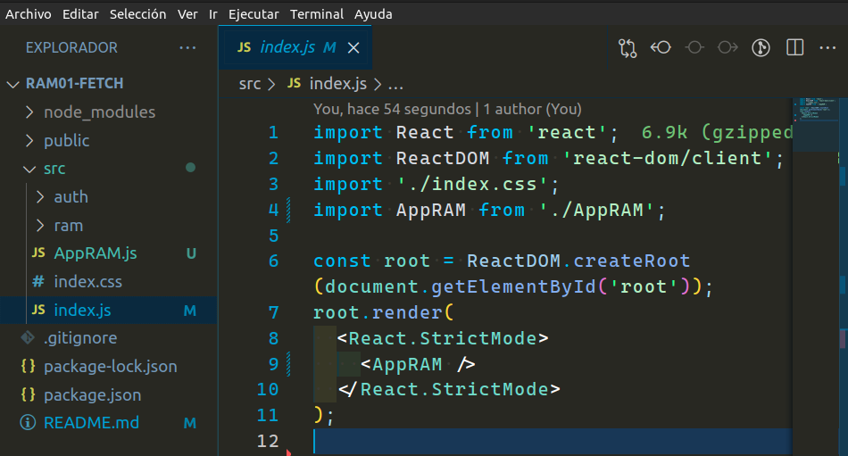
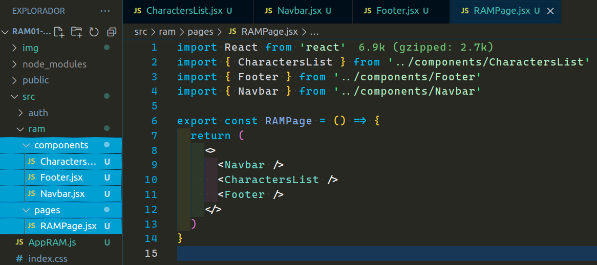
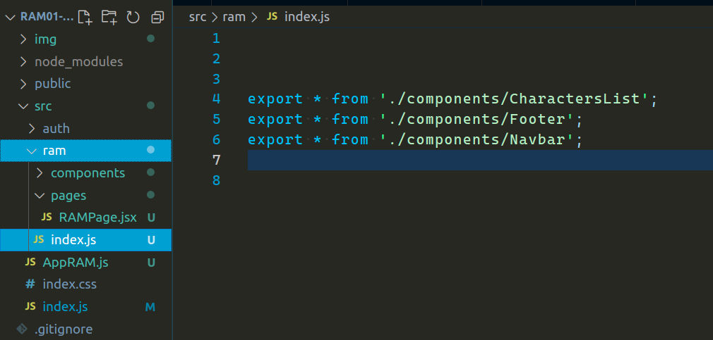
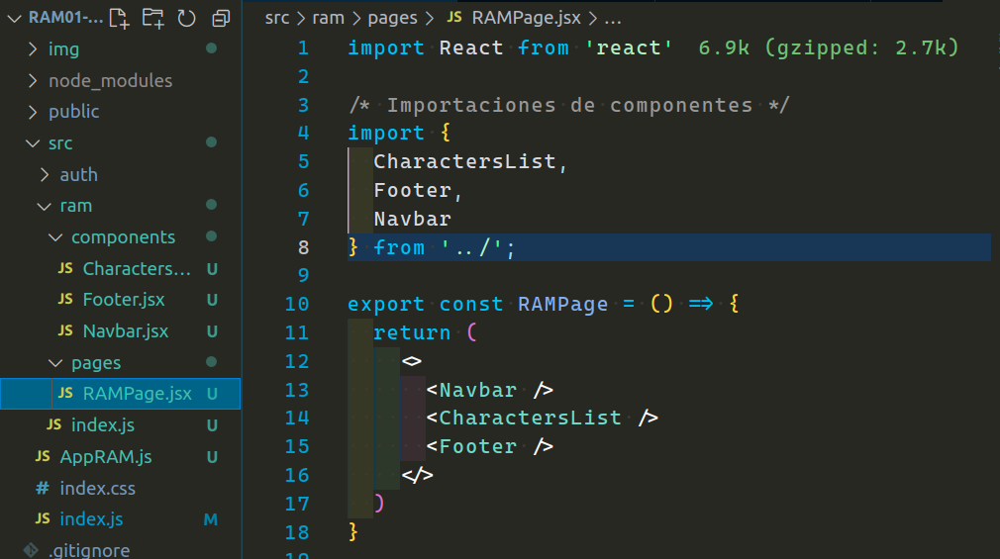
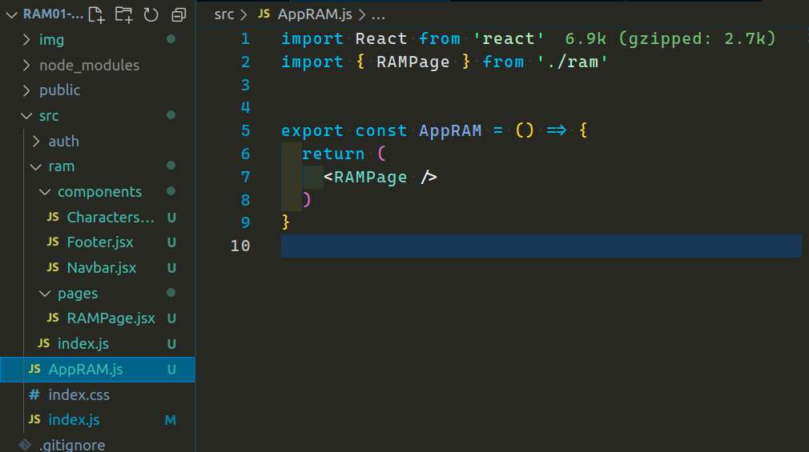
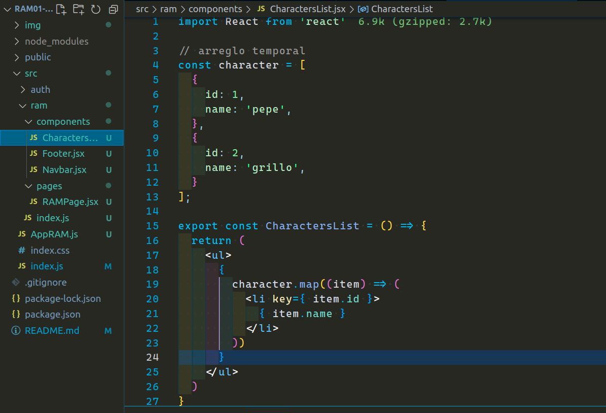

<p align='left'>
  
</P>

---

# `App Rick & Morty`

---

<a id="top"></a>

## `Bloques temáticos:`

- [**File System**](#item1)
- [**Archivos de barril**](#item2)
- [**homework**](#item3)

---

---

<a id="item1"></a>

## `File system`

File system es una forma de estructurar nuestro proyecto. La verdad es que hay muchísimas formas y dependerá de cada uno de ustedes de cómo se sienta más cómodo. Además, será muy relativo y estará sujeto acorde al proyecto que se esté por iniciar.

La razón principal de hacer este sistema es porque nuestras aplicaciones comienzan a crecer con archivos y a medida que lo hace, uno comienza sentirse en un laberinto. Nos irá costando más encontrar nuestros códigos, inclusive hasta entenderlo, porque convengamos que estamos iniciando con todos conocimientos nuevos, e ir leyendo todo el código es posible que lleguen cansados al encontrar el que buscan.

La aplicación a medida que crece nos obligará ir componetizando para poder reutilizar estos componentes y también limpiar nuestro código (que sea más legible y cómodo a la vista). Esto implica un aumento de archivos, tanto de componentes como de funciones que consumen los mismos: hooks, imágenes, páginas, etc.

Normalmente cuando iniciamos un proyecto y no tenemos las ideas muy claras de que utilizaremos, iremos creando estos directorios o carpetas cuando sea necesario. En este caso, yo al menos sé que voy a manejar un directorio para mi aplicación y otro para el registro. Cada cual tendrá sus directorios, sean componentes, páginas, etc. Por el momento la dejaré así.

**Inicio de proyecto:**


Pueden notar que mi app ya está limpia de archivos basura, o mejor dicho, que no son necesarios en este tutorial. Borré el `App` que viene inyectado por React y añadí uno nuevo llamado `AppRAM` (App Rick And Morty). Por ahora aquí es donde inyectamos nuestros componentes, al menos hasta que veamos rutas.

Voy a crear tres componentes y una página para iniciar el proyecto, después veremos si lo modificamos. Ya con esta idea necesito dos directorios más, uno `pages` y el otro `components`. Estos estarán dentro de mi directorio `ram`.



Estos son los archivos que cree. Pueden notar que mi página creada está ya inyectando los componentes recién creados. Quiero que presten suma atención a las importaciones, porque también jugará un punto importantísimo a la hora de trabajar con ellas. Este será nuestro índice y si lo mantenemos ordenado y prolijo nos dará una idea de qué estamos haciendo en todo nuestro archivo en general. Por esta razón también recomiendo una manera de ordenar estos y ponerle algún que otro comentario. Nunca está demás un comentario, sobre todo cuando comenzamos.

---

---

## `Archivos de barril`

Hay una forma muy peculiar que me agrada muchísimo ya que puedo leer mis importaciones con menos esfuerzo para la vista y así entender mejor de qué va el componente.
Obviamente puede que algunos les guste y a otros no, pero bueno, no quiero pasarlo por alto ya que si le van a dar importancia al `"índice" de las importaciones, se verán mucho más limpias las mismas y será más fácil de entender.

Voy a crear un nuevo archivo dentro de mi directorio `ram`, al mismo nivel de mis directorios `pages` y `components`. Este se va a llamar `index.js` y será mi archivo barril. Dentro de este archivo yo voy a exportar todo lo que esté dentro de los componentes de la siguiente forma:



Hago un export de "\*", ya que de esta forma le estoy diciendo que quiero exportar TODO lo que esté dentro de esos componentes.

Ahora se estarán preguntando, ¿y esto para que me va a servir?

Aquí viene la parte divertida. Ahora yo puedo importar estos tres componentes en mi `RAMPage` de una manera más eficiente y prolija para la vista a la hora de leer mis importaciones.

Aquí el ejemplo:



Como pueden ver, aquí estoy importando mis tres componentes en una sola línea. Bueno, en realidad son más líneas, pero el punto creo que se entiende.

Haré lo mismo con la página `RAMPage` para poder importarla de la misma manera en `AppRAM`.

Me dirijo nuevamente a mi archivo de barril `index.js` para exportar de igual manera a mi `RAMPage`.

archivo `index.js` de mi directorio `ram`:

```js
export * from "./components/CharactersList";
export * from "./components/Footer";
export * from "./components/Navbar";

// Se ha agregado la línea de abajo
export * from "./pages/RAMPage";
```

Importación de mi `RAMPage` en mi `AppRAM`.



Listo, ahora mi `AppRAM` está importando a mi `RAMPage` de forma más prolija. En caso de tener que importar más páginas a futuro, como un about o contacto, por ejemplo, simplemente agrego estos componentes en la misma línea ya que también estarán en el directorio `ram`. No es el caso de login y registro, que van a estar en el directorio `auth`, pero en ese directorio podemos hacer un archivo barril de la misma forma. Ya llegaremos a ese momento.

---

---

## `homework`

Con todo el conocimiento adquirido deberán consumir la api de Rick And Morty. Yo dejé un arreglo temporal para más o menos orientarlos. Ustedes deberán quitar ese arreglo temporal y recorrer todos los personajes de la Api.



1 - Dentro de mi directorio `ram` vamos a crear un nuevo directorio llamado `services`, aquí haremos nuestra llamado a la Api para obtener nuestros personajes.

El endpoint es el siguiente:

```
https://rickandmortyapi.com/api/character
```

Pueden comprobarlo e investigar en:
<https://rickandmortyapi.com/documentation/#get-all-characters>

2 - En nuestro componente `CharacterList` crear nuestros hooks:

- El `useState` deberá tener nuestra variable llamada `character` con su función `setCharacter`, éste hook debe iniciar con un arreglo vacío.

- En el `useEffect` debe ir nuestro fetch, tal y como lo hicimos en clases. Aquí también deben setear nuestro useState con toda la data obtenida.

2 - Crear un nuevo componente que se llamará `CharacterCard`, este mismo debe exportarse en el archivo barril `index.js` para posteriormente importarlo sin tener que poner la extensión `/components/CharacterCard`. Este mismo lo van a reemplazar por el `<li>` del map que recorre todos los personajes. A este componente lo van a reemplazar por el `<li>` del map que recorre todos los personajes y le pasarán las siguientes props que llegan de la Api:

- image
- name

El id que nos llega desde la Api lo pondremos en el key.

Bonus: Pueden también implementar el loading.

---

---

La resolución de este ejercicio será brindada el día después de la próxima clase, junto con el nuevo desafío.
